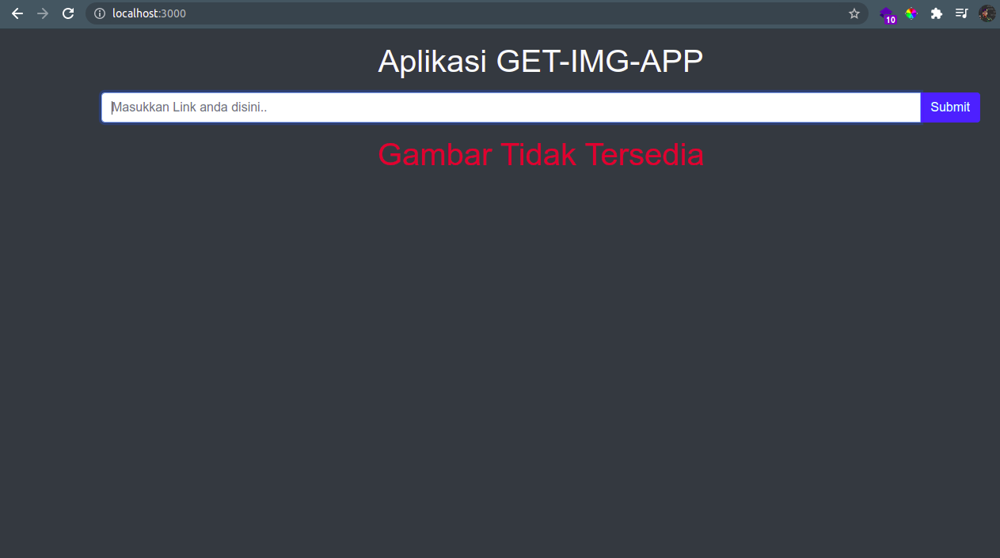
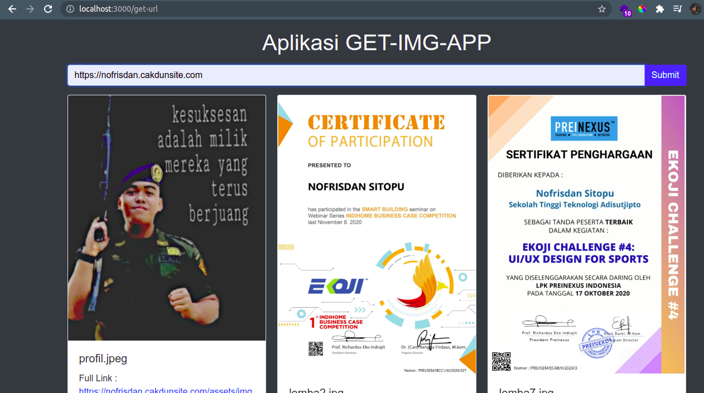

:warning: **Harap izin terlebih dahulu jika ingin menggunakan aplikasi ini, budayakan menghargai karya orang lain, silahkan izin dengan menghubungi nofrisdansitopu22@gmail.com**:

# Pengertian Aplikasi

<p>Aplikasi <code>get-img-app</code> merupakan salah satu aplikasi yang berfungsi untuk mengambil seluruh gambar pada suatu halaman website, yang dimana link gambar tersebut dapat kita gunakan pada aplikasi kita</p>

# Teknologi Yang digunakan

<ol>
    <li>Node Js</li>
    <li>Express js</li>
    <li>Cheerio</li>
    <li>Axios</li>
</ol>

# Cara instalasi

<p>Untuk Cara Instalasi Silahkan <code>clone</code> dengan cara copy source code dibawah ini :</p>

```
git clone https://github.com/Nofrisdan/Get-img-app.git

```

# Cara menjalankan aplikasi :

<p>Masuk Kedalam folder <code>aplikasi</code> : </p>

```
cd Get-img-app

```

<p>Jalankan Aplikasi </p>

```
npm start

```

<p>Buka Web Browser dan akses url : <code>http://localhost:3000</code></p>

# Gambar Aplikasi

## Tampilan Utama



## Tampilan Hasil gambar dari aplikasi


